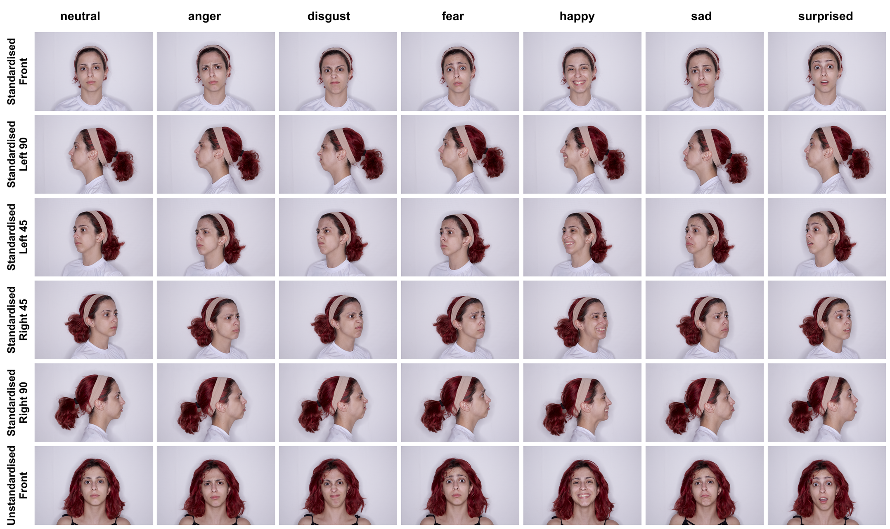
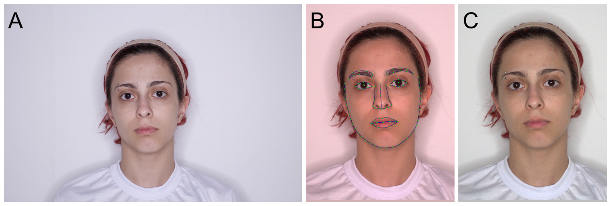
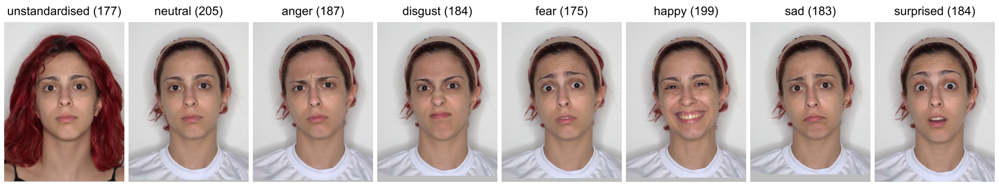

```{r}
#| label: setup
#| include: false

library(psych) # ICC, alpha, omega
library(furrr) # run code parallel
library(tidyverse)
library(patchwork)
library(flextable)
#devtools::install_github("debruine/webmorphR@dev")
#library(webmorphR)

set_flextable_defaults(digits = 2,
                       na_str = "",
                       nan_str = "")
theme_set(theme_bw(base_size = 14))

source("code/custom_functions.R")
source("code/1_dataprep.R")
source("code/2_agreement.R")
```

```{r}
# prep variables to be used later

exp_levels_neutral <- c("attractive", "trustworthy", "dominant", 
                        "memorable", "gender-typical")

exp_levels_neutral_unstd <- c("attractive (unstd)", "trustworthy (unstd)",
                              "dominant (unstd)")

exp_levels_emo_cat <- c("emotion 1", "emotion 2", "emotion 3", 
                        "emotion 4", "emotion 5", "emotion 6")

exp_levels_emo_int <- c("anger", "disgust", "fear",
                        "happiness", "sadness", "surprise")

rainbow <- c("firebrick", "darkorange", "goldenrod",
             "darkgreen", "dodgerblue3", "darkorchid4")
```

```{r eval=FALSE}
# OLD CHUNK -- KEEP FOR NOW WHILE I'M UPDATING, DELETE ONCE FINISHED
# read in main data used

# Model data
ct <- cols(
  age = col_integer(),
  height = col_integer(),
  weight = col_integer(),
  ethnicity_rec = col_factor(levels = c("White", "Black", "Asian", "Indigenous", "MENA", "Latine", "Mixed", "Ambiguous label"), include_na = TRUE)
)
data_models <- read_csv("data/manyfaces_ratings_models_cleaned.csv",
                        col_types = ct)

# Rating data (post exclusions)
exp_levels <- c("attractive", 
                "dominant", 
                "trustworthy", 
                "attractive (unstd)", 
                "dominant (unstd)", 
                "trustworthy (unstd)",
                "memorable",
                "gender-typical",
                "age",
                "anger",
                "disgust", 
                "fear", 
                "happiness", 
                "sadness", 
                "surprise",
                "emotion 1", 
                "emotion 2", 
                "emotion 3", 
                "emotion 4", 
                "emotion 5", 
                "emotion 6"
              )
ct <- cols(
  exp = col_factor(levels = exp_levels)
)
data_exp <- read_csv("data/manyfaces-pilot-exp_cleaned.csv",
                     col_types = ct)

# Questionnaire data (post exclusions)
data_qu <- read_csv("data/manyfaces-pilot-quest_cleaned.csv",
                    show_col_types = FALSE)

# Exclusions
data_excl <- read_csv("data/exclusions.csv",
                    show_col_types = FALSE)
```

## Abstract

Images of faces are crucial stimuli in various fields of research. A variety of valuable face image databases exist for research purposes, but many suffer from common limitations. A primary limitation is a lack of sufficient documentation of the methods of image collection to enable, for example, comparisons across research using images from different databases, or the collection of comparable images. Extant databases are moreover largely fixed (i.e., most face image databases do not grow once published) and are often limited in the diversity of their images (e.g., images per model, model demographic background) and/or associated data (e.g., model self-report data). Database collection is also generally possible only for well-resourced researchers, due to equipment cost and setup complexity. Here, using a big-team science approach, we sought to address these limitations by developing an open and transparent face image collection protocol, with a focus on accessibility (e.g., relatively simple setup, more affordable equipment) and reproducibility. Following this protocol at 20 sites spanning five world regions (Europe, Latin America, North America, Middle East, Southeast Asia), we moreover compile a diverse face image database with corresponding model self-report data (age, gender, ethnicity, height, weight, makeup, procedures/experiences affecting face shape) and norming data (trait ratings, emotion expression perceptions) collected from a sample of online perceivers. We make the database freely available for research use and encourage future additions to this database by following the available protocol.
  
## Introduction

Faces are rich visual stimuli, playing a key role in human social perception. They draw attention, enabling person recognition and informing social inferences  [e.g., @freeman_more_2016; @sutherland_understanding_2022; @young_recognizing_2017; @zebrowitz_reading_1997]. Various subfields within psychology—including vision science, person perception, social cognition, affective science, cognitive neuroscience, evolutionary psychology, forensic psychology, and person recognition—as well as other disciplines, such as computer science, dentistry, human biology, security, cosmetics, and medicine, address research questions involving faces and thus necessitate the use of face images as stimuli. Here, we introduce a novel face image database alongside its detailed procedures (including acquisition protocol, image processing and data gathering pipelines) for research use. The process of setting up the procedural pipeline and collecting the resulting database were part of an international multi-lab collaboration (ManyFaces) to address various limitations of existing databases. Crucially, we take a transparent approach aligned with Open Science best practices and make openly available the reproducible protocol we followed to collect the images, as well as our pipelines for processing and rating the images, enabling future expansions of the database.
  
### Existing face databases

Many face stimulus databases exist, created for various purposes and used to address a variety of research questions. Many of these are available for research purposes [see e.g., the face image meta-database to search many of these, @workman_face_2021], allowing access to a broad variety of face stimuli, well-suited to address questions in a given subfield. For example, there are many different databases in which photographed individuals (referred to as targets or models) display different facial expressions of emotion [e.g., @ebner_facesdatabase_2010; @van_der_schalk_moving_2011, of use in affective science], appear in varying lighting and angles [e.g., @burton_glasgow_2010; @gao_cas-peal_2008, useful for person recognition and forensic research], or belong to various age or racial/ethnic groups [e.g., @ma_chicago_2015; @minear_lifespan_2004; valuable for social perception research]. Such databases are highly valuable research resources.
  
However, many studies tend to rely on a small number of those stimulus databases, which introduces potential problems. For example, as of May 2026 on Google Scholar, at least 4050 published papers cite the Karolinska Directed Emotional Faces [@lundqvist_karolinska_1998], 4477 cite the NimStim Set of Facial Expressions [@tottenham_nimstim_2009], 2676 cite the Chicago Face Database [@ma_chicago_2015], and 3304 the Radboud Faces Database  [@langner_presentation_2010]. Although citation counts are not a direct measure of the use of these databases, they nonetheless indicate their popularity. This frequent (over)use of the same sets of stimuli can compromise generalizability when various research questions are tested on only a limited sample of face images from specific backgrounds [@debruine_reproducible_2022; @yarkoni_generalizability_2022]. Participants, especially those participating online, may also become familiar with frequently used stimuli, potentially introducing biases to their responses.  
  
Not all research involving face images uses stimuli from published databases. It is common for researchers to purposefully collect images themselves, but these stimulus sets are seldom openly shared (e.g., due to ethical limitations). Although this circumvents the issues with frequently-used databases, it introduces its own set of problems. Chiefly, face images collected by researchers for their own research use are often insufficiently documented. Although the resulting images may be described and/or illustrated with an example, the process of image collection is rarely described in adequate detail [consistent with broader patterns of insufficient methods reporting; e.g., @damian_transparency_2022; @zogmaister_assessing_2024]. This is often the case for even those databases openly available for research use. This lack of image acquisition (and processing) methods documentation limits transparency, replication attempts, and assessments of results’ validity [as under-characterization of stimuli can preclude identification of issues like confounding factors; see @trebicky_grim_2024]. Furthermore, different research teams often employ protocols that can differ significantly from each other in a plethora of major and minor details, including hair (e.g., free hairstyle or pulled back; facial hair allowed or not), facial accessories, makeup, lighting conditions, and colour of shirt worn. These often-unreported details further hinder comparisons between different studies. Here, we introduce a detailed image collection protocol and a resulting novel database, with the aim to provide a new and growing research resource and a transparent and rigorously documented procedure.
  
In many databases (both publicly available and not), there are also limitations in the diversity of stimuli. For example, many include only images of individuals who self-identify as White or Western [e.g., see @cook_why_2021; see also @martinez_facecraft_2025 for a discussion of the potential reification of race in face research]. This reinforces the centering of Whiteness and Western culture in psychological research, importantly limiting the ecological validity and generalizability of conclusions [see also @henrich_weirdest_2010; @roberts_challenging_2023]. Recently created databases have sought to address this, specifically collecting images of multiracial/multi-ethnic [@chen_broadening_2021; @ma_chicago_2021; @meyers_hawaii_2024] and non-Western samples, for example [e.g., @bastanfard_iranian_2007; @chung_development_2019; @courset_caucasian_2018; @saribay_bogazici_2018; @trzewik_israeli_2025; @yang_tsinghua_2020]. Continuing work is needed to further diversify the pool of available face research stimuli. Many world regions and ancestries remain underrepresented (e.g., South American, East African, First Nations, Australian Aboriginal people). This may be due, in part, to resource limitations: Equipment and setups for collecting images suitable for research use can be prohibitively expensive and complex, making database collection not feasible for everyone and everywhere, thereby limiting database diversity. Additionally, researchers with the necessary equipment may be constrained in terms of the diversity of their available participant samples’ ancestry and cultural heritage (which may shape visible facial features). The image collection protocol we introduce aims to address these issues, for example by using relatively affordable equipment and a simple set-up, and our resulting database includes models from a variety of world regions.
  
Extant databases’ diversity is often limited not only in the ethnic or cultural backgrounds of the individuals they depict, but also in the diversity of images and information that they include. For example, face image databases often include little or no self-reported information from models [e.g., only gender and broad racial/ethnic category labels; @ma_chicago_2015]. Many databases are also limited in the number of individual models pictured, and/or in the number or kinds of images available per model (e.g., variations in expression, photo angle, standardization). This likely results from the varying aims of different databases – that is, whether the focus was on a diversity of model identities represented [e.g., @bainbridge_intrinsic_2013; @long_database_2023] or a diversity of expressions or viewpoints [e.g., @chung_development_2019; @courset_caucasian_2018]. A diversity of databases is of course valuable, and no one database can include everything. However, we developed our protocol to include the collection of a variety of types of images and model self-report information, to maximize the utility of the resulting database for a variety of research purposes. We also recruited models across twenty labs, and we make the image collection protocol openly available, to enable the collection of images from a large sample of models. 
  
Face image databases are also largely fixed. That is, once collected, the number of stimuli available does not change. There are some exceptions to this, such as multiple waves of additions to the Chicago Face Database [@lakshmi_india_2021; @ma_chicago_2021]. Continued additions to databases are not the norm, however. This not only constrains the number of stimuli in any given database, increasing the likelihood of the frequent reuse of any individual stimulus, but can also render some databases obsolete over time (e.g., due to very dated model appearance/styling). Here, our openly available protocol will straightforwardly enable future additions to our database.
  
### Open Science considerations

Open and transparent methods are essential for fully understanding, evaluating, and replicating research [see, e.g., @hales_improving_2019; @klein_practical_2018; @lindsay_seven_2020; see also @govaart_sustainability_2022, for discussion of sustainability). With increased discussion of and prioritization of open science practices, methods reporting has become more open and accessible, with researchers sharing materials such as questionnaire wording, stimuli, and programming scripts [e.g., @zogmaister_assessing_2024]. Despite this, the reporting of face image database collection procedures often lacks crucial details for full transparency and reproducibility. This matters because differences in often-undocumented details (e.g., focal length) can importantly affect faces’ appearance, subsequently impacting perceptions of them [e.g., @trebicky_focal_2016; see @trebicky_grim_2024 for further discussion]. We address this here, with our openly shared image collection protocol, image processing pipeline, and image rating procedure.
  
In addition to more rigorous and open methods documentation, Big Team Science (i.e., multi-lab) endeavours and large-scale collaborations are now recognized as a vital part of improving science, including reproducibility and replicability [see forscher_benefits_2023]. Within psychology, multiple such initiatives have importantly contributed to addressing a variety of research questions, improving diversity and generalizability in the field [e.g., @jones_which_2021's investigation of the applicability of a key social perception model across various world regions]. Such an approach has yet to be applied to face stimulus collection, but it represents an opportunity to address many of the limitations of face image databases and their documentation.
  
### The current work

Here, we took an international Big Team Science approach to develop a reproducible protocol to collect a “living” database of face images, addressing many of the limitations of extant databases and their documentation. This served as the first project of ManyFaces, an international consortium of face perception and recognition researchers formed in 2022.
  
To address limitations of transparency, reproducibility, diversity, and the fixed nature of most available face image databases, we developed a comprehensive, openly available, reproducible, and accessible protocol for face image collection. We make this, together with image processing and data collection pipelines, openly available to researchers. The protocol covers equipment, settings, and instructions on collecting multiple images of each model (varying in standardization, viewing angle, and facial expression) and associated self-report data (age, gender, ethnicity, height, weight, makeup, procedures/experiences affecting face shape) to benefit a wide array of possible research areas and questions related to face perception and recognition. The data processing pipeline covers image standardization (alignment, color), subjective ratings collection, and rating data processing (including statistics on data validation and descriptives). Following these procedures, we collected images (Phase 1) in 20 different labs across the world, spanning 11 countries and five world regions (Europe, Latin America, North America, the Middle East, and Southeast Asia). This resulted in a diverse set of models and images, more than would be possible to collect in or by a single lab in a comparable timeframe. Moreover, this database is not fixed but can be added to in the future by any interested researcher following the protocol. We also validated the database (Phase 2) by recruiting online perceivers to rate a subset of the images (i.e., front-facing images) to generate norming data for key social trait perceptions and emotion recognition. We make this image database and norming data available for future research (see <https://osf.io/nkahx/> for an overview of access to the protocol, image database, and norming data). 
  
Altogether, we introduce a new, transparent, and comprehensive protocol leading to a diverse, openly available face stimulus set that can continue to grow in the future. We believe that this effort will broaden the generalizability of findings in a diverse range of disciplines that rely on face images as stimuli.
  
## Phase 1: Protocol development & stimulus collection

To set face perception and recognition Big Team Science in motion and enable conducting multi-site studies, a set of stimuli suitable for most areas (e.g., in terms of research question, geographic location) is needed. Therefore, we developed a protocol allowing us to collect such a database of face images. We developed the protocol with maximum usability and accessibility (including cost) in mind, making it transparent and readable to non-experts, and designed for use with attainable (vs. highly specialized and expensive) equipment, with minimal setup requirements, and without requiring expertise in photography. Note that the protocol is for controlled in-situ image collection to minimize external noise, to enable the collection of models’ self-report data, and to ensure the consensual use of models’ images (vs. scraping images from online sources or generating them). Photographing faces in a controlled environment thus strikes a balance in terms of ecological validity and ethical concerns [see @trzewik_israeli_2025 for discussion of the value of lab-photographed vs. artificially generated and ambient face images]. 
  
### Method

For both phases, the University of Glasgow provided ethical approval (200220177). We obtained additional local ethical approval at collaborating institutions where required.
  
#### Researcher participation

Within the broader ManyFaces consortium,^[A call to join the consortium was initially disseminated over social media, followed by an initial meeting with members to determine the general direction of the group and potential future projects. We then developed a webpage (manyfaces.team) to enable more people to join and set up a network of communication to discuss and prioritize projects.] researchers were invited to join the proposed project, led by the core team (the first three authors). The core team self-selected into the leadership of the project and developed a collaboration agreement for interested team members. This agreement outlined expectations for participation, authorship, and resolving of disagreements, and gave team members two possible roles to select (they could select either or both). The first role was membership of the Data and Methods team, involving responsibilities such as development of the protocol, organization and checking of data and files, image preparation, study pre-registration, data cleaning and analysis, and/or study testing. The second role was on the Image Collection team, which included collecting images of at least 10 participants following the protocol, preparing and sharing the image files with the core team, and checking data quality. The core team was responsible for the leadership and administration of the project, including developing all initial materials, soliciting input from team members, and making final decisions following broader team discussions/surveys.
  
#### Protocol development 

We curated a set of equipment and developed a protocol for collecting standardized, reproducible images of faces for research. Following a survey among the ManyFaces members, we constructed the protocol for the collection of a variety of images that would be useful for diverse research questions. Specifically, we included images varying in their standardization of appearance (standardized and unstandardized, e.g., white t-shirt and hair pulled back vs. clothing and hair as worn by the participant/model on that day), viewing angle (frontal, profile, ¾), and facial expression [neutral, natural, angry, disgusted, fearful, happy, sad, surprised; similar to extant facial expression databases, e.g., @ebner_facesdatabase_2010; @lundqvist_karolinska_1998; see also @ekman_emotions_1999].
  
Prior to beginning data collection, the ManyFaces team pre-tested the protocol to ensure clarity of instructions and consistency of images collected across sites. In the pre-test, volunteering members of the ManyFaces team were provided with the equipment and early drafts of the protocol to follow (i.e., collect images of a model or two) and report on issues via comments and edits to the protocol document file, online meetings, and surveys. We revised the protocol to address issues that arose (e.g., revised facial expression elicitation instructions, clarified camera settings). The version of the protocol we used in the current work can be found on the OSF (<https://osf.io/qxwvz>; see also <https://osf.io/nkahx> for all materials). In sum, the protocol detailed the following:
  
##### Image types 

The protocol defined the categories of images in terms of their standardization of appearance, viewing angle, and facial expression.

* Standardization of Appearance. In the *standardized* images, models wore a white crew neck t-shirt, had their hair pulled back or covered, included no adornments/accessories (excepting those that could not be removed for cultural reasons), and wore minimal or no makeup (models were informed about this beforehand). In contrast, *unstandardized* images showed models in their own clothing, with their hair as they came into the lab, and with adornments, except for glasses or anything that obscured the face or neck.  
* Viewing Angle. *Full frontal portraits* showed models facing the camera, *left and right profile portraits* showed each side of models’ faces in profile, and *left and right ¾ portraits* showed models’ faces at a 45-degree angle from the axis of the camera.  
* Facial Expression. *Neutral* images were of models refraining from making any facial expression, *natural* images displayed a natural expression for the model, and each facial expression of emotion displayed the expression the model would make if they were feeling the specified emotion [models instructed e.g., “face the camera with the expression you would make if you were feeling happy”, similar to instructions in the NimStim database, e.g., “make a happy face”, albeit with greater emphasis on expressions reflecting internal feelings; @tottenham_nimstim_2009].
  
##### Image prioritisation

The protocol specified which images to take (i.e., the combinations of appearance standardization, viewing angle, and facial expression), in what order, and which were most crucial to collect (as voted by project members and finalized by the core team) if researchers or models were under time constraints^[Pilot testing gave us the estimated/recommended amount of time for data collection, but some labs may have been able to devote less time due to resource or time constraints]. The order of image collection was as follows, with starred (*) images prioritized/required for each model:

* Exposure calibration photo*
* Identification & calibration photo*
* Unstandardized - Natural - Full frontal portrait
* Unstandardized - Neutral - Full frontal portrait*
* Unstandardized - Neutral - Left and Right profile portraits
* Unstandardized - Neutral - Left and Right ¾ portraits
* Unstandardized - Happy - Full frontal portrait*
* Unstandardized - Happy - Left and Right profile portraits
* Unstandardized - Happy - Left and Right ¾ portraits
* Unstandardized - All other expressions (in random or appropriate order) - Full frontal portrait
* Standardized - Natural - Full frontal portrait
* Standardized - Neutral - Full frontal portrait*
* Standardized - Neutral - Left and Right profile portraits*
* Standardized - Neutral - Left and Right ¾ portraits*
* Standardized - Happy - Full frontal portrait*
* Standardized - Happy - Left and Right profile portraits
* Standardized - Happy - Left and Right ¾ portraits
* Standardized - All other expressions (in random or appropriate order) - Full frontal portrait
  
Researchers with additional time could also capture the other expressions at different viewing angles (Left/Right profile, ¾) with either unstandardized or standardized appearance, as well as a video of standardized appearance to test out 3D image capture (not discussed further here, as this was exploratory). Researchers could capture multiple photos for each image type (e.g., take multiple unstandardized neutral full frontal portraits), but were required to select and submit only one photo per image type.
  
##### Equipment

All collaborating sites/labs used the same set of equipment. Images were captured using a Canon EOS 250d (also called Canon EOS Rebel SL3 in some regions) camera with a kit lens (Canon 18-55mm IS STM lens) and lit by an LED Ring light (Fovitec Bi-Colour LED 18” Ring Light) on a stand. For colour calibration, a Calibrite ColourChecker Classic card was used (although the colour calibration images were collected, they were not used in this project, see Phase 2, section on image processing below). Researchers provided white t-shirts for models to wear for standardized images, a white backdrop, and a chair for models to sit in.
  
##### Setup

The setup of the room used for image collection at each site required removing or minimising external light sources (e.g., using a windowless room, window blinds, turning off overhead lights) and colour spill. The protocol specified the distances at which to set up the chair for models to sit in relative to the white background and the lighting and camera rig. The protocol further specified camera setup instructions, including the specified shooting and focusing modes, shutter speed, aperture, ISO, white balance, colour space, and file type (see the Protocol file for full details; <https://osf.io/qxwvz>).
  
##### Procedure

Finally, the protocol detailed the written informed consent process, how to prepare and position models, and how to take each kind of image listed in the image prioritisation section. This included the positioning of the model’s head for each viewing angle and facial expression elicitation instructions.
  
#### Stimulus collection

```{r}
lab_n <- data_models$lab_id |> unique() |> length()

models_per_site <- count(data_models, lab_id)$n
mean_mps <- mean(models_per_site) |> round(1)
```

Following the protocol, `r lab_n` labs (1 in Austria, 2 in Brazil, 2 in Canada, 2 in Germany, 1 in Israel, 3 in Malaysia, 1 in Mexico, 1 in the Netherlands, 1 in Serbia, 4 in the UK, and 2 in the US) collected images of an average of `r mean_mps` models per site. As specified by the protocol, researchers collected multiple images of each model, within the time constraints of the study session.
  
Models furthermore completed a self-report demographic questionnaire (<https://osf.io/7w5du/files/q3p7d>; available in English, Brazilian Portuguese, Hebrew, and Spanish) on Experimentum [@debruine_experimentum_2020], , reporting their age, gender, ethnicity (each open response), height, and weight (specifying unit of measurement along with a number for the latter two). They also reported whether they were wearing makeup (and specified what kinds, e.g., foundation, eye makeup, semi-permanent makeup) and whether they had ever experienced anything that could affect the shape of their face (e.g., broken nose, cosmetic surgery or injections, orthodontic work) and specified this if they were willing. Finally, they completed a debriefing questionnaire (<https://osf.io/7w5du/files/26b8c>) asking them about their experience of posing for the images (e.g., whether instructions were clear, whether any part of the process was uncomfortable).
  
### Results

#### Images

```{r}
model_n <- nrow(data_models)
## *** to update following further withdrawals ***
```

`r model_n` total models provided their images, following withdrawals and exclusions for poor image quality (as determined by the researchers collecting the images and the core team). @tbl-images-per-type details the number of models for each kind of photo. Example images are shown in @fig-img-examples. Images are freely available for research use and can be accessed via UK Data Service ReShare: [**link to be added**]. Note that researchers must agree to our terms of use to access the database, in line with ethical constraints (see [**link**]).


```{r}
#| label: tbl-images-per-type
#| tbl-cap: The number of images available for each image type.

## TO UPDATE W/ ALL COUNTS (INCLUDING DIFFERENT ANGLES) & MORE READABLE LABELS ***

emo_levels <- c(neu = "neutral", 
              #  nat = "natural",
                ang = "angry", 
                dis = "disgusted", 
                fea = "fearful", 
                hap = "happy", 
                sad = "sad", 
                sur = "surprised")

image_type_n <- data_models |>
  select(model_id:unstd_neu) |>
  pivot_longer(std_ang:unstd_neu) |>
  filter(value == 1) |>
  count(name) |>
  separate(name, c("type", "emotion")) |>
  pivot_wider(names_from = type, values_from = n) |>
  mutate(emotion = factor(emotion, names(emo_levels), emo_levels)) |>
  arrange(emotion)

image_type_n |>
  flextable()
```

```{r}
#| label: fig-img-examples
#| fig-cap: Example images of each level of standardization, angle, and expression
#| fig-alt: "A 7x6 grid of pictures of a woman in a white t-shirt with a white headband, showing different angles and expressions. Top labels: neutral, angry, disgusted, fearful, happy, sad, surprised. Side labels: standardized front, standardized left 90 (side profile), standardized left 45 (three-quarter profile), standardized right 45, standardized right 90, unstandardized front."

#*** UPDATE IMAGE LABELS TO BE GRAMMATICALLY CONSISTENT, ADD 'NATURAL' 


```


#### Model self-report

```{r}
# count faces per ethnicity category
eth_rec <- count(data_models, ethnicity_rec, .drop = FALSE)
eth_n <- as.list(eth_rec$n)
names(eth_n) <- c(as.character(eth_rec$ethnicity_rec[1:8]), "NA")
```

For data cleaning, we first downloaded and reshaped the raw data from Experimentum. In the next step, we ensured that the models’ self-reported gender, race/ethnicity, and units of height and weight were consistently formatted across labs.
For gender and race/ethnicity, words presented in languages other than English were recoded to be presented in English (e.g., “mulher” to “female”, “preta” to “Black”). Two members of the research team then classified self-described race/ethnicity into one of seven categories (checked by a third team member): “White” (n = `r eth_n$White`), “Black” (n = `r eth_n$Black`), “Asian” (n = `r eth_n$Asian`), “Indigenous” (n = `r eth_n$Indigenous`), “MENA” (Middle Eastern or North African; n = `r eth_n[["Middle Eastern or North African (MENA)"]]`), “Latine” (n = `r eth_n$Latine`), or “Mixed” (n = `r eth_n$Mixed`)), where possible. Descriptions that could not be clearly sorted into these categories were given “Ambiguous label” (n = `r eth_n[["Ambiguous label"]]`) and non-entries were recoded as NA (n = `r eth_n[["NA"]]`). Note that the models’ original self-reported phrasing of their gender and race/ethnicity is available in the model self-report data file included with the image database.
  
For height, we ensured all data were presented in centimeters, and for weight, we ensured that all data were presented in kilograms. Models could report height and weight in metric or imperial units, so we converted from imperial to metric where required. We also sanity-checked the reported units, assuming heights > 100 to be in centimeters and those < 100 to be in inches, and weights < 80 to be in kilograms. Any non-entries of height or weight for a model was recoded as NA.

```{r}
#| label: tbl-model-demog
#| tbl-cap: Summary of model age, height, and weight self-report, separated by gender

data_models |>
  mutate(gender = gender_rec) |>
  summarise(
    .by = gender,
    n = n(),
    age_min = min(age, na.rm = TRUE),
    age_max = max(age, na.rm = TRUE),
    age_mean = mean(age, na.rm = TRUE),
    age_sd = sd(age, na.rm = TRUE),
    height_min = min(height_cm, na.rm = TRUE),
    height_max = max(height_cm, na.rm = TRUE),
    height_mean = mean(height_cm, na.rm = TRUE),
    height_sd = sd(height_cm, na.rm = TRUE),
    weight_min = min(weight_kg, na.rm = TRUE),
    weight_max = max(weight_kg, na.rm = TRUE),
    weight_mean = mean(weight_kg, na.rm = TRUE),
    weight_sd = sd(weight_kg, na.rm = TRUE)
  ) |>
  flextable() |>
  add_header_row(values = c("", "Age (years)", "Height (cm)", "Weight (kg)"),
                colwidths = c(2, 4, 4, 4)) |>
  set_header_labels(age_min = "min", 
                    age_max = "max",
                    age_mean = "M",
                    age_sd = "SD",
                    height_min = "min", 
                    height_max = "max",
                    height_mean = "M",
                    height_sd = "SD",
                    weight_min = "min", 
                    weight_max = "max",
                    weight_mean = "M",
                    weight_sd = "SD") |>
  colformat_char(j = 1) |>
  colformat_double(digits = 1) |>
  flextable::width(j = 1, width = 1)
          
```
  
*Note.* See @fig-model-age in SM for histograms.

## Phase 2: Validation/norming data

We next obtained subjective ratings of a subset of the photos (front-facing) to validate the emotion expressions (their perceived emotion category and intensity) and collect norming data on central social perceptions, namely perceived attractiveness, dominance, trustworthiness, gender-typicality, memorability, and age. We chose these ratings due to their central importance in the person perception, face recognition, and emotion perception literatures [e.g., @bainbridge_intrinsic_2013, @jack_four_2016, @oosterhof_functional_2008; @perrett_your_2017; @sutherland_social_2013]. We preregistered this study on the OSF (<https://osf.io/4d5v9>) in April 2025.
  
### Method

#### Image processing

RAW images were processed using webmorphR [@debruine_reproducible_2022], which facilitates scriptable processing of images using imagemagick [@imagemagick] (a full script of the processing steps is available at <https://github.com/ManyFacesTeam/imgprep>). Briefly, 

* Each face was delineated using the Face++ automatic face detection algorithm (see <https://www.faceplusplus.com/>) to generate a 106-point template.
* All images were resized to 1000w by 1500h pixels to standardize size (two different RAW formats were used, which resulted in two different image sizes)
* The median RGB colour value of a 100×100 pixel patch at the upper left corner was calculated to fill in any edges from alignment.
* The image was repositioned and cropped (not rotated or resized) such that
    * The image size was 675w by 900h pixel
    * point 71 (between the eyes) was relocated to position [.5w, .4h]
* This aligned image was saved as a lossless PNG using imagemagick default settings (e.g., sRGB colour space).
* A white balance correction was applied to the resulting images, calculated from the mean RGB values in the 25x25 pixel top-right corner patch (white background) ^[We did not fully colour-calibrate the images here (see Discussion) but future researchers may wish to do so.] 
* These images were converted to JPEGs with a quality setting of 75 to reduce file size and enable interoperability across browsers and devices for stimulus display online.
These processed images are available alongside the full set of RAW images in the image database [**link to be added**].
  
```{r}
#| label: fig-img-processing
#| fig-cap: "Image processing steps: (A) the raw image, (B) the image automatically delineated and cropped to a standard alignment, (C) white balance correction."


```

#### Stimuli

```{r}
# count images for each emotion and unstandardised
emo_n <- as.list(image_type_n$std)
names(emo_n) <- image_type_n$emotion
unstd <- image_type_n$unstd[[1]]
```

The number of stimuli was determined by the number of models recruited across the 20 research labs and how many models posed for each image type. The maximum number of targets per image type was 205^[The preregistration mis-stated the total number of models, rather than the maximum number of images, to be 205. The total number of models was 211], meaning each rater saw up to 205 stimuli. We obtained ratings of the front-facing standardized neutral (n = `r emo_n$neutral`), unstandardized neutral (n = `r unstd`), standardized angry (n = `r emo_n$angry`), standardized disgusted (n = `r emo_n$disgusted`), standardized fearful (n = `r emo_n$fear`), standardized happy (n = `r emo_n$happy`), standardized sad (n = `r emo_n$sad`), and standardized surprised (n = `r emo_n$surprised`) images.


```{r}
#| label: fig-stim-examples
#| fig-cap: An example of each type of stimulus, with the total number of stimuli of that type in parentheses.
#| fig-alt: "Example face images for the 8 types of stimuli: unstandardized (177), neutral (205), angry (187), disgusted (184), fearful (175), happy (199), sad (183), surprised (184)"

# *** CHANGE LABELS IN IMAGE TO BE GRAMMATICALLY CONSISTENT ***


```


#### Attention check stimuli

Additionally, we created stimuli for attention checks. These were white images with the same size and aspect ratio as the face stimuli, but contained only the written instruction to choose a specific response, (e.g., ‘Choose “fear”’ or ‘Choose “3”’).
  
#### Measures

##### Standardized neutral faces

###### Trait ratings

We obtained ratings of faces’ attractiveness, dominance, trustworthiness, memorability, and gender-typicality ("How attractive [dominant, trustworthy, memorable, gender-typical] does this person look?"). Ratings were on scales ranging from 1  (*not at all*) to 7 (*very*).
  
###### Age ratings

We obtained ratings of faces’ perceived age (“How old does this person look?”), with responses collected in 5-year ranges/brackets (i.e., 16-20, 21-25, …, 76-80, 81+).
  
##### Unstandardized neutral faces

###### Trait ratings

We obtained ratings of faces’ attractiveness, dominance, and trustworthiness on scales ranging from 1 (*not at all*) to 7 (*very*).
  
##### Standardized emotional faces

###### Emotion categorization

We obtained impressions of the emotion each person was expressing (“What emotion is this person expressing?”), choosing one from: *anger, disgust, fear, happiness, sadness, surprise, other*. Here, raters categorized a counterbalanced mixture of expressions (from one of six counterbalanced conditions) rather than faces all showing the same expression. The 201 identities with emotion expression images were divided into six groups of up to 34 images, and each counterbalanced condition showed a different emotion expression for each of the six groups, such that no identity was shown more than once to each rater. Since not all identities had all six emotion expressions, the number of images in each counterbalanced condition ranged from 179 to 193.
  
###### Emotion intensity ratings

We obtained ratings of how intensely faces expressed each intended emotion (“How intensely is this person expressing anger [disgust, fear, happiness, sadness, surprise]?”) from 1 (*not at all*) to 7 (*very*). Here, raters only rated all faces showing one emotion expression (e.g., all angry faces) and rated the intensity only of the intended expression (e.g., angry faces only rated on anger intensity).
  
#### Procedure

We collected ratings via Experimentum [@debruine_experimentum_2020]; a structure file for the exact experimental setup is available on the OSF (<https://osf.io/7w5du/files/zc2b3>). After a brief introduction to the study and online informed consent, each participant (rater) was randomly allocated to one of the ratings (e.g., rating all 205 standardized neutral faces on how memorable they look). All available faces were displayed one at a time, in a randomized order for each rater. The question/prompt and response scale remained visible at the top of the screen, above the photo throughout the study. The study automatically progressed to the next trial once the rater responded by clicking on the response scale. There was no time limit to provide a response. We included seven attention checks embedded in the study, which directed raters to provide a specific response.
  
Following rating or categorizing all stimuli, raters self-reported their gender, age, race/ethnicity, country of residence, and device type used for the study (desktop, laptop, tablet, mobile). They also completed an honesty/attention check question, asking them if they engaged with the study seriously, with assurance of payment regardless of response (choosing from “no, I was not really paying attention” and “yes, I tried to give my authentic first impressions”).
  
We recruited a gender-balanced sample of fluent English-speaking raters through Prolific (we included no other screening criteria). We collected all data in May 2025^[This was slightly later than preregistered (April 2025), due to pretesting and study setup delays. Note that we also planned to collect perceived race/ethnicity data, but decided against this, due to the regional specificity of race/ethnicity labels.].
  
#### Participants

We aimed to collect 100 raters per rating condition to achieve stable averages and allow for exclusions [@hehman_assessing_2025], totalling 2100 raters. Altogether, `r initial_raters` raters completed the study and received compensation in line with Prolific’s guidelines. See Results for exclusions and demographics of the final sample.

### Results

#### Data cleaning and exclusions

In the raters’ demographic questionnaire, we standardized participants’ recording of their race/ethnicity similarly to the models by recoding their inputs into one of seven categories (“White”, “Black”, “Asian”, “Indigenous/Pacific Islander”, “MENA” (Middle Eastern or North African), “Latine”, or “Mixed”), or as “Ambiguous” when this was not possible. Any non-entries were recoded as NA. Raters’ original self-reported labels are available in the data shared on Github. 
  
A total of `r initial_raters` raters completed `r initial_completions` rating or categorization tasks. We found that some raters did not complete all trials in tasks, some raters completed more than one task, and some raters completed more than the maximum number of trials in a task (likely by restarting the study or bypassing the back button block). Therefore, we removed incomplete tasks from our data, retained raters’ first complete tasks, and filtered our duplicate trials by keeping only raters’ first ratings for a duplicated trial. After these exclusions, and before implementing the pre-registered plan for data exclusions, we had complete and clean data from `r complete_raters` raters.
  
Our pre-registered plan for data exclusions included removing raters who gave overly consistent responses, committed overly fast responses, self-reported not taking the study seriously when asked whether or not they completed the study authentically, and failed attention checks. In total, we excluded `r excluded_raters` raters for our pre-registered reasons for data exclusions. @tbl-exclusions in the Supplementary Material (SM) shows the number of raters we excluded for each of our reasons.
  
We defined overly consistent responses as those raters who responded to at least 90% of trials identically. During agreement analyses (see Agreement Indicators for the Ratings, below), we found that `r additionally_excl` additional raters only gave two unique responses across all trials and also excluded these as overly consistent. We defined overly fast responses as those raters whose median reaction time fell below the 1st percentile of the overall distribution of median reaction times (see Figure S1 for the distribution of median reaction times). For our attention checks, the threshold for inclusion was to accurately complete six or more attention checks (i.e., participants were excluded if they failed more than one of the checks). Lastly, participants were excluded based on a self-reported honesty check, i.e., if they reported not taking the study seriously rather than taking it authentically. After these exclusions, we had `r final_raters` raters in our sample (with between 80 and 114 raters per rating task; see @tbl-raters-per-task in SM for the number of raters per task).
  
Anonymous data are available on Github (<https://github.com/ManyFacesTeam/pilot-ratings>).
 
#### Rater demographics

```{r}
n_demog_provided <- data_quest$session_id |> unique() |> length()

age <- data_quest |>
  ungroup( ) |> 
  summarise(M = mean(age, na.rm=TRUE),
            SD = sd(age, na.rm=TRUE)) |> 
  mutate(across(everything(), ~round(.x, 2)))

gender <- count(data_quest, gender, sort = TRUE)
gender_n <- setNames(gender$n, gender$gender)

ethnicity <- count(data_quest, ethnicity_rec, sort = TRUE)
ethnicity_n <- setNames(ethnicity$n, ethnicity$ethnicity_rec)

devices <- count(data_quest, device, sort = TRUE)
devices_n <- setNames(devices$n, devices$device)
```

We collected the following demographic data from our raters (N = `r n_demog_provided` provided data): Age, gender, residence, ethnicity, and devices on which the ratings were completed. Raters were predominantly younger adults (M age = `r age$M` years, SD = `r age$SD`; see @fig-age in SM for histogram), male (n = `r gender_n["male"]`; `r gender_n["female"]` female, `r gender_n["non-binary"]` nonbinary), and Black (n = `r ethnicity_n["Black"]`; `r ethnicity_n["White"]` White, `r ethnicity_n["Asian"]` Asian, `r ethnicity_n["Latine"]` Latine, `r ethnicity_n["Mixed"]` mixed, `r ethnicity_n["MENA"]` MENA; `r ethnicity_n[["Indigenous / Pacific Islander"]]` Indigenous or Pacific Islander; `r ethnicity_n["Ambiguous label"]` ambiguously labelled or unreported), and spanned world regions (primarily Africa, Americas, and Europe; see @tbl-raters-country in SM for breakdown by country). Participants completed the study on a variety of devices (`r devices_n["laptop"]` laptop, `r devices_n["desktop"]` desktop computer, `r devices_n["phone"]` mobile phone, `r devices_n["tablet"]` tablet). 
  
#### Agreement Indicators for the Ratings

In the first step, we calculated intraclass correlation coefficients [ICC(2,k)] for each of the ratings. The average reliability across raters was excellent for ratings of standardized and unstandardized neutral faces’ attractiveness, dominance, and trustworthiness, standardized neutral faces’ gender-typicality, and standardized emotional faces’ emotion intensity (.84 ≤ ICC ≤ .98), but poorer for ratings of standardized neutral faces’ memorability (ICC = .58; see @tbl-icc in SM).
  
Next, we examined the number of raters required for ratings to reach stable levels of reliability defined as ICC(2,k) values of 0.75 (see @fig-icc-cos). Emotion intensity and attractiveness ratings stabilized with the fewest participants (reaching a median ICC(2,k) of 0.75 at 10 raters for happiness, disgust, and surprise; 20 for anger, fear, sadness, and attractiveness) and were also the only ratings to exceed a median ICC(2,k) of 0.90. Ratings for dominance, trustworthiness, and gender-typicality stabilized at larger samples (reached a median ICC(2,k) of 0.75 with 40-60 raters), whereas ratings for memorability did not reach these levels of reliability.

```{r}
#| label: fig-icc-cos
#| fig-cap: Corridors of stability for ICC
#| fig-subcap:
#|   - "Note. Dashed horizontal lines indicate ICC(2,k) of 0.75 and 0.90, respectively."
#| fig-height: 15
#| fig-width: 10

(results_trait_std$plot + 
    ggtitle("A Standardized neutral trait ratings")) /
  (results_trait_unstd$plot + 
     ggtitle("B Unstandardized neutral trait ratings")) /
  (results_emo_int$plot + 
     ggtitle("C Standardized emotion intensity ratings")) +
  plot_layout(heights = c(2, 1, 2))
```

To further check inter-rater agreement, we used both Cronbach’s alpha (α) and McDonald’s omega total (ωt; see @tbl-icc in SM). For attractiveness, dominance, trustworthiness, gender-typicality, and emotion intensity ratings, both measures indicated excellent inter-rater agreement (.88 ≤ α ≤ .99; .90 ≤ ωt ≤ .99). For ratings of memorability, α was lower (0.66), suggesting reduced inter-rater agreement. ωt for memorability was substantially higher (0.87), suggesting better agreement under the assumption that raters varied in how consistently they judged memorability, a pattern consistent with the lower ICC observed for this trait.
  
#### Points of stability

To determine the number of raters required for stable ratings, we computed the point of stability [@hehman_assessing_2025], defined as the smallest sample size at which 95% of resampled means fall within a corridor of stability of ±0.5 points and do not again exceed it.^[Note that we declared stability when the *upper* bound crossed inside the threshold, whereas Hehman and colleagues declare stability when the lower/nearer bound crosses inside the threshold.] As shown in @fig-pos, the ratings of standardized images reached stability between 37 and 44 raters, the ratings of unstandardized images between 37 and 41 raters, and emotion intensity ratings of standardized emotional faces between 29 and 50 raters.

```{r}
#| label: fig-pos
#| fig-cap: Points of stability for ratings
#| fig-subcap:
#|   - "Note. Dashed horizontal lines indicate corridor of stability at +/- 0.5 points. Vertical lines indicate point of stability."
#| fig-height: 15
#| fig-width: 10

p_std <- plot_pos(summary_ci_traits,
                  stability_stats_traits$pos, 
                  fill_values = rainbow, 
                  exp_levels = exp_levels_neutral)

p_unstd <- plot_pos(summary_ci_traits_unstd,
                    stability_stats_traits_unstd$pos, 
                    fill_values = rainbow, 
                    exp_levels = exp_levels_neutral_unstd)

p_emo <- plot_pos(summary_ci_emo_int,
                  stability_stats_emo_int$pos, 
                    fill_values = rainbow)

(p_std + ggtitle("A Standardized neutral trait ratings")) /
  (p_unstd + ggtitle("B Unstandardized neutral trait ratings")) /
  (p_emo + ggtitle("C Standardized emotion intensity ratings")) +
  plot_layout(heights = c(2, 1, 2))
```

#### Descriptive statistics

In this section, we report the descriptive statistics for ratings of the neutral standardized images, the neutral unstandardized images, the emotion categorization task, the intensity of expressed emotions, and the ages of the models.
  
##### Standardized and unstandardized neutral trait ratings

For standardized neutral faces, trustworthiness, dominance, and memorability ratings were approximately normally distributed and showed similar patterns of central tendency and variance. In contrast, attractiveness ratings were somewhat right-skewed, whereas gender-typicality ratings were left-skewed (see @fig-neu-hist).

```{r}
std_neutral <- data_exp |>
  filter(exp %in% exp_levels_neutral) |>
  mutate(dv = as.integer(dv),
         exp = factor(exp, exp_levels_neutral)) |> 
  separate_wider_delim(trial_name,
                       delim = "_",
                       names = c("lab_id", "model_id"),
                       too_many = "drop")

unstd_neutral <- data_exp |>
  filter(exp %in% exp_levels_neutral_unstd) |>
  mutate(dv = as.integer(dv),
         exp = factor(exp, exp_levels_neutral_unstd)) |> 
  separate_wider_delim(trial_name,
                       delim = "_",
                       names = c("lab_id", "model_id"),
                       too_many = "drop")

# calculate proportions for plot
std_prop <- std_neutral |> 
  group_by(exp) |> 
  count(exp, dv) |> 
  mutate(prop = n / sum(n)) |>
  ungroup() 

unstd_prop <- unstd_neutral |> 
  group_by(exp) |> 
  count(exp, dv) |> 
  mutate(prop = n / sum(n)) |>
  ungroup() 

# calculate M & SD, create labels for plot
std_MSD <- std_neutral |> 
  summarise(mean_rating = mean(dv),
            .by = c("exp", "lab_id", "model_id")) |> 
  summarise(M = mean(mean_rating),
            SD = sd(mean_rating),
            .by = "exp") |>
  mutate(label = paste(round(M, 2), " (", 
                       round(SD, 2), ")", sep = ""))
unstd_MSD <- unstd_neutral |> 
  summarise(mean_rating = mean(dv),
            .by = c("exp", "lab_id", "model_id")) |> 
  summarise(M = mean(mean_rating),
            SD = sd(mean_rating),
            .by = "exp") |>
  mutate(label = paste(round(M, 2), " (", 
                       round(SD, 2), ")", sep = ""))
```


```{r}
#| label: fig-neu-hist
#| fig-cap: Histograms and descriptive statistics for trait ratings of standardized and unstandardized neutral faces
#| fig-subcap:
#|   - "Note. Values in top right of each panel represent M (SD)."
#| fig-width: 8
#| fig-height: 8

plot_std <- std_prop |>
  ggplot(aes(x = dv, y = prop,
             fill = exp)) +
  geom_bar(stat="identity", show.legend = FALSE, 
                 colour = "white", alpha = .8) +
  facet_wrap(~exp, ncol = 3, axes = "all_x", drop = FALSE) +
  geom_text(data = std_MSD,
            mapping = aes(x = 6, y = .3, label = label)) +
  scale_x_continuous(breaks = 1:7) +
  labs(title = "A Standardized neutral trait ratings",
       x = "Rating",
       y = "Proportion") +
  theme_minimal() +
  theme(strip.text = element_text(size = 11, face = "bold"),
        axis.text = element_text(size = 10),
        axis.title = element_text(size = 12, face = "plain"),
        title = element_text(size = 12)) +
  scale_fill_manual(values = rainbow, drop = FALSE)

plot_unstd <- unstd_prop |>
  ggplot(aes(x = dv, y = prop,
             fill = exp)) +
  geom_bar(stat="identity", show.legend = FALSE, 
                 colour = "white", alpha = .8) +
  facet_wrap(~exp, ncol = 3, axes = "all_x", drop = FALSE) +
  geom_text(data = unstd_MSD,
            mapping = aes(x = 6, y = .3, label = label)) +
  scale_x_continuous(breaks = 1:7) +
  labs(title = "A Unstandardized neutral trait ratings",
       x = "Rating",
       y = "Proportion") +
  theme_minimal() +
  theme(strip.text = element_text(size = 11, face = "bold"),
        axis.text = element_text(size = 10),
        axis.title = element_text(size = 12, face = "plain"),
        title = element_text(size = 12)) +
  scale_fill_manual(values = rainbow, drop = FALSE)

(plot_std) / (plot_unstd) +
  plot_layout(heights = c(2, 1))
```


##### Emotion categorization and intensity ratings

Next, we explored raters’ emotion categorizations and perceived emotion intensity expressed by our models. Raters’ categorizations generally aligned with the models’ expression of emotion, with the greatest alignment observed for expression of happiness, and the least for fear, with fearful faces most often perceived as expressing surprise (see @fig-emo-freq, @tbl-emo-desc in SM). 

```{r}
emo_cat <- data_exp |>
  filter(exp %in% exp_levels_emo_cat) |>
  mutate(exp = factor(exp, exp_levels_emo_cat),
         dv = factor(dv, levels = c("anger", "disgust", 
                                    "fear","happiness",
                                    "sadness", "surprise",
                                    "other"))) |> 
  separate_wider_delim(trial_name,
                       delim = "_",
                       names = c("lab_id", "model_id", 
                                 NA, "model_expression", NA),
                       too_many = "drop") |> 
  mutate(model_expression = forcats::fct_recode(
    model_expression,
    anger = "ang",
    disgust = "dis",
    fear = "fea",
    happiness = "hap",
    sadness = "sad",
    surprise = "sur"
  ))
```


```{r}
#| label: fig-emo-freq
#| fig-cap: Emotion categorization frequencies
#| fig-subcap:
#|   - "Note. Downward arrows indicate correct categorizations (categorizations matching intended model expression)."
#| fig-width: 8
#| fig-height: 5.5

emo_levels <- levels(emo_cat$model_expression)
emo_labels <- paste(emo_levels, "faces")

# calculate proportions
emo_prop <- emo_cat |> 
  group_by(model_expression) |> 
  count(model_expression, dv) |> 
  mutate(prop = n / sum(n)) |>
  ungroup()

emo_prop |>
  mutate(emo = factor(model_expression, emo_levels, emo_labels)) |>
  ggplot(aes(x = dv, y = prop, fill = dv)) +
# ***triangle to highlight intended emotion not rendering properly ***
#  geom_point(aes(x = x, colour = I(fill), fill = I(fill)), 
#             data.frame(emo = factor(emo_levels, 
#                                     emo_levels, emo_labels),
#                        x = 1:6,
#                        fill = rainbow),
#             size = 6.5, y = -60, shape = 18, 
#             show.legend = FALSE) +
  geom_bar(color = "transparent", stat="identity", 
           alpha = .8) +
  facet_wrap(~emo, axes = "all_x", drop = FALSE) +
  scale_x_discrete(labels = c("", "", "", "", "", "", "")) +
  scale_fill_manual(values = c(rainbow, "grey"), drop = FALSE) +
  labs(title = "Standardized emotion categorizations",
       x = "Categorization",
       y = "Proportion",
       fill = "Categorized as") +
  coord_cartesian(clip = "off") +
  theme_minimal() +
  theme(axis.ticks.x = element_blank(),
        strip.text = element_text(size = 12, face = "bold"),
        axis.text = element_text(size = 10),
        axis.title = element_text(size = 12, face = "plain"))
```
  
Next, we calculated the average ratings of emotion intensity for each emotion  (@fig-intensity-hist). These ratings were very similar, on average, between the different emotions except for happiness, which was rated with greater intensity than all other emotions. On average, these ratings were located around the middle of the 7-point scale. 

```{r}
emo_int <- data_exp |>
  filter(exp %in% exp_levels_emo_int) |>
  mutate(dv = as.integer(dv),
         exp = factor(exp, exp_levels_emo_int)) |> 
  separate_wider_delim(trial_name,
                       delim = "_",
                       names = c("lab_id", "model_id"),
                       too_many = "drop")

# calculate proportions for plot
emo_int_prop <- emo_int |> 
  group_by(exp) |> 
  count(exp, dv) |> 
  mutate(prop = n / sum(n)) |>
  ungroup() 

# calculate M & SD, create labels for plot
emo_MSD <- emo_int |>
  summarise(mean_rating = mean(dv),
            .by = c("exp", "lab_id", "model_id")) |> 
  summarise(M = mean(mean_rating),
            SD = sd(mean_rating),
            .by = "exp") |>
  mutate(label = paste(round(M, 2), " (", 
                       round(SD, 2), ")", sep = ""))
```


```{r}
#| label: fig-intensity-hist
#| fig-cap: Histograms of emotion intensity ratings
#| fig-subcap:
#|   - "Note. Values in top right of each panel represent M (SD)."
#| fig-width: 8
#| fig-height: 5.5

emo_int_prop |>
  ggplot(aes(x = dv, y = prop,
             fill = exp)) +
  geom_bar(stat="identity", show.legend = FALSE, 
                 colour = "white", alpha = .8) +
  facet_wrap(~exp, ncol = 3, axes = "all_x", drop = FALSE) +
  geom_text(data = emo_MSD,
            mapping = aes(x = 6, y = .3, label = label)) +
  scale_x_continuous(breaks = 1:7) +
  ylim(0,.3) +
  labs(title = "Standardized emotion intensity ratings",
       x = "Rating",
       y = "Proportion") +
  theme_minimal() +
  theme(strip.text = element_text(size = 11, face = "bold"),
        axis.text = element_text(size = 10),
        axis.title = element_text(size = 12, face = "plain"),
        title = element_text(size = 12)) +
  scale_fill_manual(values = rainbow, drop = FALSE)
```

##### Perceived age

```{r}
dv_levels <- seq(20, 85, 5)
dv_labels <- paste(dv_levels-4, "-", dv_levels )
dv_labels[14] <- "81+"

age <- data_exp |>
  filter(exp == "age") |>
  mutate(dv = factor(dv, dv_levels, dv_labels)) |> 
  separate_wider_delim(trial_name,
                       delim = "_",
                       names = c("lab_id", "model_id"),
                       too_many = "drop")

# Save modal age for each face
age_modes <- age |>
  group_by(lab_id, model_id) |>
  summarise(out = list(get_mode_info(dv)),
            .groups = "drop") |>
  unnest_wider(out)

age_perc <- age_modes |> 
  mutate(age_mid = age_mode) |> 
  separate(age_mid, into = c("age_start", "age_end"), sep = "-", convert = TRUE) |> 
  mutate(age_perc = (age_start + age_end) / 2) |> 
  select(-age_start, -age_end)

age_by_face <- data_models |> 
  dplyr::select(lab_id, model_id, age) |> 
  rename(age_actual = age) |> 
  left_join(age_perc, by = c("lab_id", "model_id"))

# Get stats
age_by_face_cortest <- 
  cor.test(age_by_face$age_actual, age_by_face$age_perc)
age_by_face_df <- age_by_face_cortest$parameter
age_by_face_r <- round(age_by_face_cortest$estimate,2)
age_by_face_p <- age_by_face_cortest$p.value
p_comp = "="
if (age_by_face_p < .001) {
  age_by_face_p = .001
  p_comp <- "<"
}
```

The distribution of raters’ perceptions of models’ ages is shown in @fig-age-hist (see @fig-model-age in SM for actual age). The most chosen age across raters and models was 26–30 years. The correlation between models’ mode perceived age and actual age was strong,*r*(`r age_by_face_df`) = `r age_by_face_r`, p `r p_comp` `r age_by_face_p`. 

```{r}
#| label: fig-age-hist
#| fig-cap: Histogram of perceived age
#| fig-width: 8
#| fig-height: 4

age |>
  ggplot(aes(x = dv, y = after_stat(count / sum(count)))) +
  geom_bar(color = "orchid", fill = "orchid", alpha = .8) +
  scale_x_discrete(drop = FALSE) +
  labs(title = "Standardized neutral perceived age",
       x = "age categories (in years)", 
       y = "proportion") +
  theme_minimal() +
  theme(axis.text = element_text(size = 10),
        axis.title = element_text(size = 12, face = "plain"),
        title = element_text(size = 12))
```


## Discussion

### The value of the current work

This first ManyFaces team project provides a unique contribution to the current landscape of face image datasets by developing a comprehensive, transparent, open, and accessible protocol (<https://osf.io/qxwvz>) to collect and process face images. Following this, we additionally introduce a database (accessed via ReShare **LINK**, subject to agreement to Terms of Use) that provides a diverse face image stimulus set in terms of models’ geographic location and image variety (appearance standardization, viewing angle, and facial expression). The diversity of images within the database makes it potentially useful to address a variety of research questions in multiple areas of psychology (e.g., face recognition, emotion perception) and beyond. 
  
Additionally, the database need not remain fixed: Other researchers can follow the provided procedures and add to the database, further increasing its sample size and diversity (e.g., in terms of model age, ethnicity, culture, and geographic location). Researchers wishing to contribute to the database can contact the ManyFaces team (via <ManyFacesDatabase@gmail.com>) to have their images linked on our database landing page (<https://osf.io/nkahx/>; future additions will therefore have a distributed database structure, enabling greater flexibility than a single, centrally managed database structure). The protocol can also serve as a template for researchers interested in collecting stimulus images, in terms of highlighting the kinds of details that need to be considered and documented.
  
The data associated with the images are also valuable. First, we collected ground-truth information from models, namely their self-reported demographic information (age, gender, ethnicity), body measurements (height, weight), and information about any makeup worn in the photos and any experiences or procedures which may have affected their facial appearance, each of which is useful for various kinds of research questions. The validation/norming data we collected (<https://github.com/ManyFacesTeam/pilot-ratings>) also provide a useful starting point for researchers interested in using the images, for example enabling researchers to choose subsets of images most suited to address their research questions. 
  
### Validation/norming ratings

The patterns of ratings we obtained largely converge with published research. The higher intensity ratings of happiness expressions, compared to the other expressions, is similar to previous findings. For example, faces expressing happiness in the Radboud Faces Database were rated higher in intensity than most expressions (except fear) and higher in clarity than all other expressions [@langner_presentation_2010], and happy faces in the Karolinska Directed Emotional Faces were similarly rated higher in intensity than most expressions [but not differing significantly from disgust or surprise; @goeleven_karolinska_2008] Additionally, we found emotion recognition to be highest for happy expressions. These results align with other emotion recognition research using posed facial expressions of emotion. For example, emotion recognition was highest for faces expressing happiness in the Radboud Faces Database [@langner_presentation_2010], FACES [@ebner_facesdatabase_2010], the Karolinska Directed Emotional Faces [@calvo_facial_2008]; @goeleven_karolinska_2008], NimStim [@tottenham_nimstim_2009], and a sample of faces selected from various face image databases [@palermo_photographs_2004]. Similarly, raw recognition scores of the Amsterdam Dynamic Facial Expression Set (videos, rather than images) were highest for joy [@van_der_schalk_moving_2011]. 
  
We also found recognition accuracy to be lowest for fearful expressions, which were most often misperceived as expressing surprise. Research using the Karolinska Directed Emotional Faces [@calvo_facial_2008]; @goeleven_karolinska_2008] and NimStim faces [@tottenham_nimstim_2009] showed a similar pattern, albeit to a less extreme extent (i.e., fearful faces were often misperceived as surprised – and vice versa – but nonetheless most often correctly categorized). This finding is also consistent with research showing substantial overlap in the expressions of fear and surprise [i.e., in their Action Units; @jack_four_2016]. Altogether, however, recognition accuracy of expressions other than happiness was lower in our sample of face images, compared to face images in other databases, which is likely attributable to other databases’ more specific and directed emotion expression elicitation procedures [e.g., conforming to prototypical Action Unit patterns; @ebner_facesdatabase_2010; @langner_presentation_2010], compared to our protocol, and/or others’ use of actors as models [e.g., @lundqvist_karolinska_1998; @tottenham_nimstim_2009]. Whether our noisier emotion expressions may be perceived as more natural or authentic than more clearly-posed or exaggerated expressions, however, remains an open question.
  
The distributions of the trait ratings we obtained are similar to those observed for other face databases. For example, ratings of neutral face images in the Chicago Face Database [@ma_chicago_2015] showed relatively normal distributions for trustworthiness, right-skew for attractiveness, and left-skew for gender-typicality, as we observed for our standardized neutral faces. However, although we observed fairly normally-distributed dominance ratings, these were somewhat right-skewed for the Chicago Face Database. The high correspondence between self-reported and perceived ages is also consistent with existing findings on age perception from face images [e.g., @ebner_facesdatabase_2010; see also @voegeli_differences_2021]. Finally, the number of raters needed to reach stable averages (between 29 and 50, depending on the rating) are overall comparable to those demonstrated in extant work [@hehman_assessing_2025], albeit somewhat higher.
  
### Reflections, limitations, and future directions

Having a broad variety of areas of expertise and diverse research backgrounds within the team was crucial to developing the protocol, collecting the database and ratings, and troubleshooting issues. We moreover found that setting out expectations at the start of the project through a collaboration agreement was essential. However, we ran into various issues throughout the process, many of which are common to Big Team Science initiatives [see, e.g., @baumgartner_how_2023; @forscher_benefits_2023; @vaidis_advantage_2026]. For example, with so many labs and individual researchers involved, timelines for completion necessarily stretched. This made momentum difficult to maintain at times. Planning in generous buffer time for such large-scale projects and managing team members’ expectations around timelines is therefore essential. We also faced difficulty in finding an optimal way to communicate effectively with all team members, given varying preferences (e.g., via email vs. other team communication platforms) and time zones (for meetings). It is perhaps worth surveying members of a big team at project start about communication possibilities, as well as outlining more specific communication expectations in a collaboration agreement.
  
After Phase 1, we surveyed the ManyFaces research team to provide feedback on the process of collecting images using the protocol. Team members commonly expressed the desire for additional concise guidance in following the protocol, including an additional abbreviated protocol with numbered steps to follow during data collection and a video tutorial (in addition to the provided illustrative images) showing the necessary steps for researchers unfamiliar with camera equipment. These are requests that we can incorporate into future protocol updates. Doing so could both make the process easier for researchers and minimize errors and deviations from the protocol, ensuring greater reproducibility and consistency between sites.
  
The major issue raised by the research team was the difficulty of eliciting facial expressions as described in the protocol (e.g., minimal differences in models’ expressions between emotions) – an issue not unique to the current work. The protocol took a straightforward instructive approach to emotion elicitation (e.g., asking participants to face the camera with the expression they would make if they were feeling happy), following consultation with emotion experts in ManyFaces and discussion of feasibility and cultural variability with the wider team. However, models self-reported difficulty with the facial expression posing, in line with researchers’ feedback. The emotion validation data also suggest that models struggled to pose some of the facial expressions of emotion, or that their poses of these expressions did not always clearly align with perceivers’ expectations of what different emotion expressions should look like. Indeed, perceivers demonstrated some difficulty identifying the intended emotions from these posed facial expressions, especially for fear (as discussed above). The exception to this pattern was happiness expressions, which were consistently accurately identified and perceived as higher in intensity than the other emotion expressions. A likely explanation for this was our protocol’s minimal direction of models’ facial expressions, in contrast to more directed procedures to elicit prototypical expressions [e.g., @langner_presentation_2010; @trzewik_israeli_2025], as noted above. Such procedures may be easier for models to follow and produce expressions that are more clearly recognizable. However, these can come at the cost of obscuring cultural differences in emotion expression [e.g., @elfenbein_nonverbal_2013], which is why we ultimately did not use such a directed procedure in our protocol. Additionally, recent research shows posed expressions to not appear genuine and reveals differing perceptions of posed and spontaneous expressions [@dawel_perceived_2017; @dawel_faking_2025], suggesting that future work, including possible updates to our own protocol, may therefore focus on developing a better framework to elicit facial expressions. This could include taking inspiration from databases of naturally-induced emotion [e.g., @miolla_padova_2023; @sneddon_belfast_2012] and considering potential cultural differences and specific local needs.
  
The research team also raised several comments about the provided and not-provided equipment, specifically the flimsiness of the light stand, and the missing standardized backdrop (due to shipping constraints, participating researchers each sourced a white background, e.g., a wall, seamless fabric, or paper). It is worth highlighting that equipment was selected to work within several practical constraints: budget, university-approved vendors’ inventory, shipping logistics, interoperability, and ease of use for non-experts in varying conditions. The available project budget and administrative restrictions on approved vendors (their offerings and stock) for the University of Glasgow primarily limited the attainable camera, lens, and lighting setup. In general, we opted to create a setup that would not be prohibitively expensive to acquire, could be shipped in a single parcel, and would be compatible (substitutable) with equipment other researchers may have available. The last consideration was creating a setup with the fewest degrees of freedom, and thus less room for error. Therefore, we opted to use an LED ring light with a camera mounted inside the ring in landscape orientation on a single stand (vs. portrait orientation using a different kind of mount or separate stands for the camera and light). Ring lights became ubiquitous and easy to acquire in recent years; they only need to be positioned square, level, and in front of the sitter. Other, more complex setups can be created; however, the price, mobility, and repeatability of such setups may represent major constraints to consistent and reliable image collection. It is therefore worth considering trade-offs between different kinds of equipment and setups in future work. Some simple and practical improvements, however, may include having a spare charged camera battery and additional memory card available, as well as either tethering the camera to a laptop or using a mobile app to take the photos (vs. physically touching the camera, which can induce motion).
  
In addition to our choices of equipment, we also made certain pragmatic choices during image processing that future work could improve on. For example, in Phase 2, we white-balanced the images rather than fully colour-correcting them, as we were able to create a fully reproducible scripted method for the former process, but not the latter. This was due to limitations such as varied colour checker chart placement and orientation in models’ photos (which could be better standardized in future protocol updates) and a lack of expertise or availability on the research team to work around this variation in a completely reproducible way. We therefore opted to simply white-balance to keep the process entirely open and reproducible, rather than fully colour-correct using a manual and not fully reproducible method. It is worth noting that we used the white backdrop in each photo to white balance, which introduces some variability, given that each site sourced their own backdrop. Crucially, images including the colour checker charts are available in the database, enabling future researchers to pursue more rigorous colour calibration. The process of aligning and sizing the images in Phase 2 was also driven by cropping needs. That is, due to the landscape orientation of the photos, there was limited vertical space that we could crop, constraining the possibilities for face alignment and image size. Future work could consider using alternative equipment setups to enable capturing images in portrait mode. Variation in faces’ size in the images, due to some deviations from the distances specified in the protocol, also affected the image processing steps. This could be addressed in future work by more clearly highlighting not only the key aspects of the protocol that should be kept constant, but also why these aspects should be constant (i.e., clarifying the reasoning to all team members).
  
Finally, we collected images of 211 models<!-- update after withdrawals finalised -->, but no single image type (e.g., front-facing standardized happy, profile unstandardized neutral) included images of all models. Rather, the maximum number of models represented in a single image type was 205 images (front-facing standardized neutral). Thus, although the database includes multiple images per model, the number of images per model varies, and the number of models for each image type also varies. Additionally, this means that not all models have rating data available for each type of rating (e.g., emotion intensity, age). This may have implications for some researchers’ future use of the database (e.g., if a certain number of images is needed per model).
  
Altogether, this work indicates that various labs, all following the same protocol and using the same equipment, can compile a coherent face database. This broadens opportunities for future image database collection: A database does not need to all be collected by one lab in one location. Future work could, however, specifically quantify variations between images in our database originating from different labs, comparing this to images collected within a single lab.
  
### Conclusion

Here, we introduce a comprehensive face image collection protocol and a new diverse face image database, collected across sites in 11 countries spanning five world regions. The database includes multiple images per model, with images varying in standardization, photo angle and expression, in addition to both self-report data from models and perception data for a variety of central social traits and emotions. Altogether, this ensures the utility of the database for researchers interested in a variety of questions in diverse fields, including those related to social perception, person recognition, and vision science. The protocol, which emphasizes accessibility and feasibility, transparently documents the steps taken to collect the face images, opening doors for future additions to this database and the development of future multi-lab databases.
  
## Acknowledgements
We thank all of our participants, both models and raters, who made this research possible.
  
This research was funded by a Biotechnology and Biological Sciences Research Council International Partnerships Funding grant (320172; via University of Glasgow MVLS), awarded to Lisa DeBruine, Vít Třebický, and R. Thora Bjornsdottir, and a Czech Science Foundation grant (GAČR 23-05408S) awarded to Vít Třebický.
With respect to the contributions of J. Brendan Ritchie, Maleah J. Carter, and Shruti Japee, this research was supported in part by the Intramural Research Program of the National Institutes of Health (NIH) (ZIAMH 002909). The contributions of the NIH authors are considered Works of the United States Government. The findings and conclusions presented in this paper are those of the authors and do not necessarily reflect the views of the NIH or the U.S. Department of Health and Human Services.
  
## CRediT statement
Note that the first three authors led the current project, and the order of all other authors listed on the manuscript was randomized. Each author's contributions are noted via CRediT.
  
```{r}
#| message: false

read_csv("author_CRediT.csv") |>
  select("Name", "Contributions") |>
  flextable() |>
  flextable::width(j = 1, 3)
```


# Supplementary Material

```{r warning=FALSE}
#| label: fig-model-age
#| fig-cap: Histogram of model age, height, and weight in Phase 1
#| fig-width: 8
#| fig-height: 10

p_age <- age_by_face |> 
  ggplot(aes(x = age_actual)) +
  geom_histogram(binwidth = 1, fill = "orchid", alpha = .8) +
  scale_x_continuous(breaks = seq(15, 85, 5)) +
  labs(title = "A Model self-reported age",
       x = "age (years)", 
       y = "count") +
    theme_minimal() +
    theme(axis.text = element_text(size = 10),
        axis.title = element_text(size = 12, face = "plain"),
        title = element_text(size = 12)) 

p_height <- data_models |>
  ggplot(aes(x = height_cm)) +
  geom_histogram(binwidth = 1, fill = "#F7AE8F", alpha = .8) +
  labs(title = "B Model self-reported height",
       x = "height (cm)", 
       y = "count") +
    theme_minimal() +
    theme(axis.text = element_text(size = 10),
        axis.title = element_text(size = 12, face = "plain"),
        title = element_text(size = 12)) 

p_weight <- data_models |>
  ggplot(aes(x = weight_kg)) +
  geom_histogram(binwidth = 1, fill = "orange", alpha = .8) +
  labs(title = "C Model self-reported weight",
       x = "weight (kg)", 
       y = "count") +
    theme_minimal() +
    theme(axis.text = element_text(size = 10),
        axis.title = element_text(size = 12, face = "plain"),
        title = element_text(size = 12)) 

(p_age) / (p_height) / (p_weight) 

```

```{r}
#| label: fig-rt-distribution
#| fig-cap: Median reaction time distribution in Phase 2
#| fig-subcap:
#|   - "Note. Red dashed line indicates exclusion cutoff."

med_rt |> 
  ggplot(aes(x = med_rt)) +
  geom_histogram(binwidth = 100, boundary = 0, 
                 fill = "dodgerblue", alpha = .8) +
  geom_vline(xintercept = quantile(med_rt$med_rt, 
                                   probs = 0.01), 
             color = "red", linetype = "dashed", linewidth = 1) +
 # coord_cartesian(xlim = c(0, 8000)) +
 # scale_x_continuous(expand = expansion(mult = 0)) +
  scale_x_continuous(breaks = seq(0, 10000, 500)) +
  labs(title = "Median rater reaction time",
       x = "median RT (ms)",
       y = "count (per 100ms bin)")  +
  theme_minimal() +
    theme(axis.text = element_text(size = 10),
        axis.title = element_text(size = 12, face = "plain"),
        title = element_text(size = 12)) 
```

```{r}
#| label: fig-age
#| fig-cap: Histogram of rater age in Phase 2

data_quest |> 
  ggplot(aes(x = age)) +
  geom_histogram(binwidth = 1, fill = "orchid", alpha = .8) +
  scale_x_continuous(breaks = seq(15, 85, 5)) +
  labs(title = "Rater self-reported age",
       x = "age (years)", 
       y = "count") +
    theme_minimal() +
    theme(axis.text = element_text(size = 10),
        axis.title = element_text(size = 12, face = "plain"),
        title = element_text(size = 12)) 
```

```{r}
#| label: tbl-exclusions
#| tbl-cap: The number of raters excluded from analysis in Phase 2

exclusions |> 
  summarise(
    `Overly consistent` = sum(!is.na(same_pcnt)),
    `Overly fast` = sum(!is.na(med_rt)),
    `Failed honesty check` = sum(!is.na(honesty_check)),
    `Failed attention checks` = sum(!is.na(attn_checks_passed)),
    `Total` = n()
  ) |> 
  pivot_longer(
    cols = everything(),
    names_to = "Reason for exclusion",
    values_to = "N"
  ) |>
  flextable() |>
  flextable::width(j = 1, 2)

```
*Note.* Multiple raters met more than one exclusion criterion; therefore, the counts for individual criteria do not sum to the total number of raters excluded.

```{r}
#| label: tbl-raters-per-task
#| tbl-cap: Number of raters per task in Phase 2

# make task names more readable
data_exp_rename <- data_exp |>
  mutate(exp = case_when(exp=="attractive (unstd)" ~ 
                          "attractive (unstandardized)",
                        exp=="dominant (unstd)" ~ 
                           "dominant (unstandardized)",
                        exp=="trustworthy (unstd)" ~
                          "trustworthy (unstandardized)",
                        exp=="anger" ~ "anger intensity",
                        exp=="disgust" ~ "disgust intensity",
                        exp=="fear" ~ "fear intensity",
                        exp=="happiness" ~ "happiness intensity",
                        exp=="sadness" ~ "sadness intensity",
                        exp=="surprise" ~ "surprise intensity",
                        exp=="emotion 1" ~ 
                          "emotion categorization 1",
                        exp=="emotion 2" ~ 
                          "emotion categorization 2",
                        exp=="emotion 3" ~ 
                          "emotion categorization 3",
                        exp=="emotion 4" ~ 
                          "emotion categorization 4",
                        exp=="emotion 5" ~ 
                          "emotion categorization 5",
                        exp=="emotion 6" ~ 
                          "emotion categorization 6",
                        .default = exp))

data_exp_rename |>
  summarise(.by = exp,
            raters = unique(session_id) |> length()
            ) |>
  arrange(exp) |>
  flextable() |>
  set_header_labels(exp = "Rating task",
                    raters = "N") |>
  flextable::width(j = 1, 2)
```
*Note*. The emotion rating task was broken into 6 counterbalanced versions.

```{r}
#| label: tbl-raters-country
#| tbl-cap: Rater country of residence in Phase 2

# convert country codes to names
data_quest_rename <- data_quest |>
  mutate(residence = case_when(residence=="ZA" ~ "South Africa",
                               residence== "GB" ~ "United Kingdom",
                               residence== "US" ~ "United States",
                               residence== "PL" ~ "Poland",
                               residence== "PT" ~ "Portugal",
                               residence== "CA" ~ "Canada",
                               residence== "ES" ~ "Spain",
                               residence== "IT" ~ "Italy",
                               residence== "KE" ~ "Kenya",
                               residence== "DE" ~ "Germany",
                               residence== "GR" ~ "Greece",
                               residence== "HU" ~ "Hungary",
                               residence== "IN" ~ "India",
                               residence== "MX" ~ "Mexico",
                               residence== "CL" ~ "Chile",
                               residence== "FR" ~ "France",
                               residence== "IE" ~ "Ireland",
                               residence== "BR" ~ "Brazil",
                               residence== "NL" ~ "Netherlands",
                               residence== "SE" ~ "Sweden",
                               residence== "AU" ~ "Australia",
                               residence== "HR" ~ "Croatia",
                               residence== "CZ" ~ "Czechia",
                               residence== "EE" ~ "Estonia",
                               residence== "LV" ~ "Latvia",
                               residence== "BE" ~ "Belgium",
                               residence== "DK" ~ "Denmark",
                               residence== "IL" ~ "Israel",
                               residence== "CH" ~ "Switzerland",
                               residence== "SI" ~ "Slovenia",
                               residence== "DZ" ~ "Algeria",
                               residence== "AR" ~ "Argentina",
                               residence== "AT" ~ "Austria",
                               residence== "CN" ~ "China",
                               residence== "FI" ~ "Finland",
                               residence== "KZ" ~ "Kazakhstan",
                               residence== "MA" ~ "Morocco",
                               residence== "SK" ~ "Slovakia"))

data_quest_rename |> 
  count(residence) |>
  #ungroup() |> 
  summarise(.by = n, res = 
              paste(residence, collapse = ", ")) |>
  arrange(desc(n)) |>
  select(res, n) |>
  flextable() |>
  set_header_labels(res = "Country of residence", n = "N") |>
  flextable::width(j = 1, 2)
```

```{r}
#| label: tbl-icc
#| tbl-cap: Intraclass correlation coefficients, Cronbach’s alpha, and McDonald’s omega for trait and emotion intensity ratings

# join ICC, alpha, & omega values
icc_a_o_table <- icc_table |>
  mutate(`ICC\n[95% CI]` = 
           paste(ICC, "\n[", lower, ", ", upper, "]", sep="")) |>
  select(-c(ICC, lower, upper)) |>
  full_join(alpha_omega_table, by = c("Rating", "N")) |>
  mutate(alpha = round(alpha, 2),
         omega = round(omega, 2),
         # make labels more readable
         Rating = case_when(Rating=="attractive (unstd)" ~ 
                          "attractive (unstandardized)",
                        Rating=="dominant (unstd)" ~ 
                           "dominant (unstandardized)",
                        Rating=="trustworthy (unstd)" ~
                          "trustworthy (unstandardized)",
                        Rating=="anger" ~ "anger intensity",
                        Rating=="disgust" ~ "disgust intensity",
                        Rating=="fear" ~ "fear intensity",
                        Rating=="happiness" ~ "happiness intensity",
                        Rating=="sadness" ~ "sadness intensity",
                        Rating=="surprise" ~ "surprise intensity",
                        .default = Rating))

icc_a_o_table |>
  flextable() |>
  flextable::width(j = 1, 1.5)
```

```{r}
#| label: tbl-emo-desc
#| tbl-cap: Emotion categorization proportions

emo_cat |> 
  group_by(model_expression) |> 
  count(model_expression, dv) |> 
  mutate(prop = n / sum(n)) |>
  ungroup() |> 
  dplyr::select(-n) |> 
  pivot_wider(names_from = dv,
              values_from = prop) |> 
  relocate(other, .after = surprise) |>
  rename("Actual model expression" = model_expression) |>
  flextable() |>
  colformat_double(digits = 2) |>
  flextable::width(j = 1, 2) |>
  add_header_row(values = c("", "Categorized expression"), colwidths = c(1, 7)) |>
  align(i = 1, align = "center", part = "header")
```
